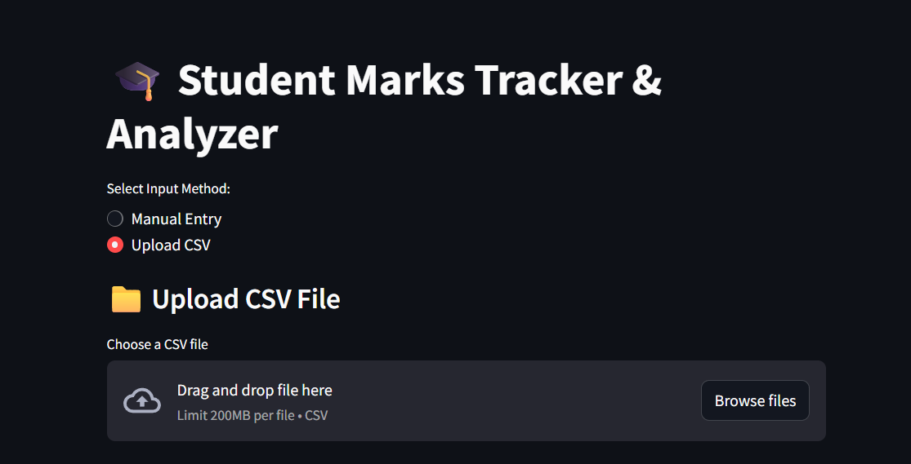

# 📊 Student Marks Tracker & Analyzer

A user-friendly web application built using **Streamlit** and **MongoDB**, designed to help manage, track, and analyze student marks. The app supports importing marks via CSV, manually adding student data, editing/deleting records, and viewing analytical dashboards. This is ideal for teachers, students, and educational institutions.

---

## 📖 Project Overview

The **Student Marks Tracker & Analyzer** is built to solve the common problem of managing student data across multiple subjects efficiently. Traditional tools like Excel are error-prone and lack automation and interactivity. This web application provides a seamless experience for entering, updating, and analyzing marks with a few clicks.

The platform supports both **CSV uploads** and **manual entries**, and automatically stores all data in a **MongoDB Atlas** cloud database for persistence. It then uses **Streamlit** to create interactive dashboards that display total and average scores, subject-wise performance, and historical records of data imports or edits.

Whether you're a teacher managing multiple classes or a student tracking your progress, this tool provides clarity and saves time.

---

## ✅ Features

- 📥 Import student marks via CSV files
- 🖊️ Add new student records manually
- 🔍 Search students by name to edit/delete entries
- 📈 Visual dashboard with analytics and graphs
- 🧾 Track all past data uploads and entries

## 🛠️ Technologies Used

| Tool/Library      | Purpose                                     |
|-------------------|---------------------------------------------|
| **Python**        | Programming language                        |
| **Streamlit**     | Web application frontend                    |
| **Pandas**        | Data manipulation and analysis              |
| **MongoDB Atlas** | Cloud-based database to store student data  |
| **Pymongo**       | Python-MongoDB connector                    |
| **Matplotlib**    | For visualizations and charts               |


## 🖼️ Dashboard Preview


## Uploading .csv File
 The input can done by manual entry or importing .csv File.



## Student Record


## Student Editing & Deleting
we can Edit the marks or name of the student.And also delete the student Record.


## Data Analysis


## Visuaization


## 🧑‍💻 Step-by-Step Project Setup

### 1️⃣ Create a Local Project Folder

```bash
mkdir student-marks-tracker
cd student-marks-tracker